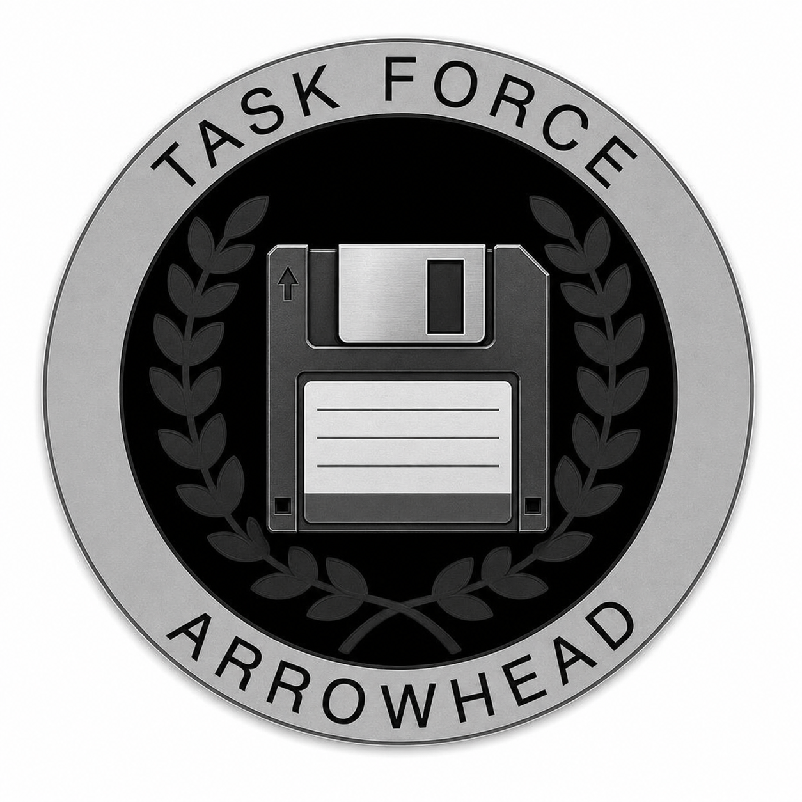

# TFAR Radio Settings Save & Restore

<p align="center">
  
</p>

TFAR Radio Settings Save & Restore remembers personal Task Force Arrowhead Radio
settings across missions and Arma sessions. Saving and restoration is done via ACE Self Interact.

This mod:

* Saves and restores active channels, main and additional channel volumes, stereo routing, additional channels, speaker states, and channel frequencies for all matching carried radios.
* Allows each player to create named profiles for different combinations of radio settings.
* Provides CBA keybind actions for manually saving to or restoring from the active profile; both are unbound by default.

Vehicle radios are currently not included.

## Requirements

- Arma3
- CBA_A3
- ACE3
- Task Force Arrowhead Radio (TFAR)

## Installation

1. Download the latest release archive from GitHub.
2. Extract it into an `@TFAR-Radio-Settings-Save-and-Restore` folder in an Arma 3 mod directory.
3. Enable TFAR Radio Settings Save & Restore together with CBA_A3, ACE3, and TFAR.

TFAR Radio Settings Save & Restore stores profiles locally and performs its work
on the player client. A server does not need to execute its profile logic, although
communities using signature verification should install the included public
key or distribute the addon through their normal modset.

## Build

Install [HEMTT](https://hemtt.dev/) and run:

```text
hemtt check
hemtt build
```

The built mod is written to `.hemttout/build`.

## In-game setup

Frequency persistence and notifications are per-player options under **Options

> Addon Options > TFAR Radio Settings Save & Restore**. These options are local and do not create
> server traffic. Named-profile saving and restoration are always manual.

The primary controls are under **ACE Self Interaction > Radios > Settings**:

- **Show Currently Active Profile Settings (profile name)** displays the active
  profile for ten seconds.
- **Restore Settings > Confirm** immediately restores the active profile
  to matching radios currently carried.
- **Save Settings > Confirm** updates the active profile.
- **Manage Profiles** opens the interface used to create, activate and restore,
  inspect, rename, and delete profiles.

Equivalent unbound CBA keybinds remain available under
**Options > Controls > Configure Addons** as an accessibility fallback.

The named profiles are versioned and stored in the local player's
`profileNamespace`. A setup includes every supported handheld radio
currently carried plus the player's backpack radio. It contains radio base
classes and user-facing radio properties, never TFAR instance IDs, player
ownership IDs, or encryption codes.

Profile restoration occurs only after a deliberate player action. It affects
matching radios currently carried and then ends. Missing radios are reported
and left unchanged; no request remains pending for radios acquired later. This
prevents received, loaned, captured, or specially configured radios from being
silently changed.
